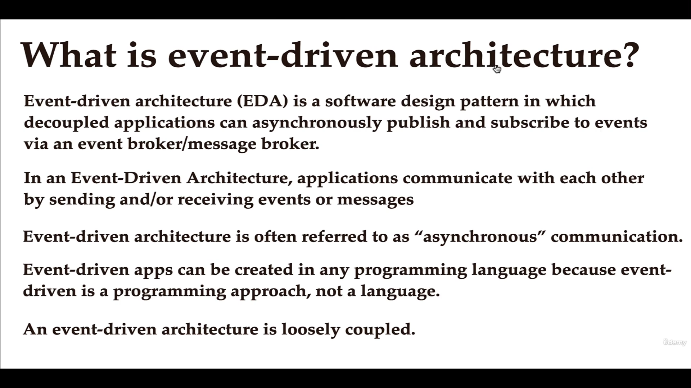
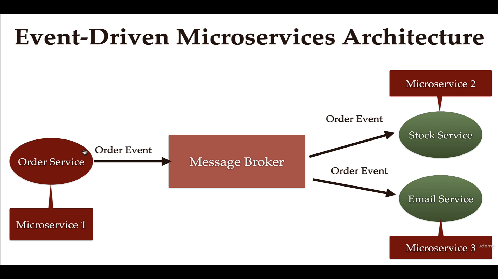
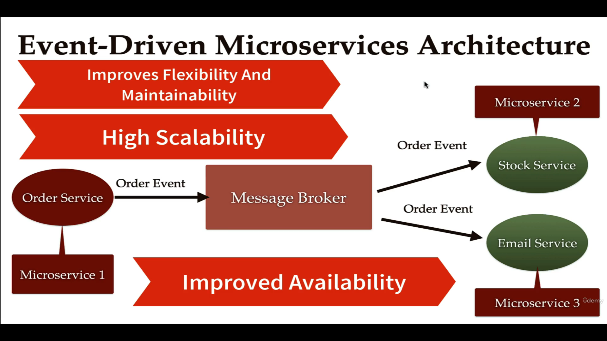
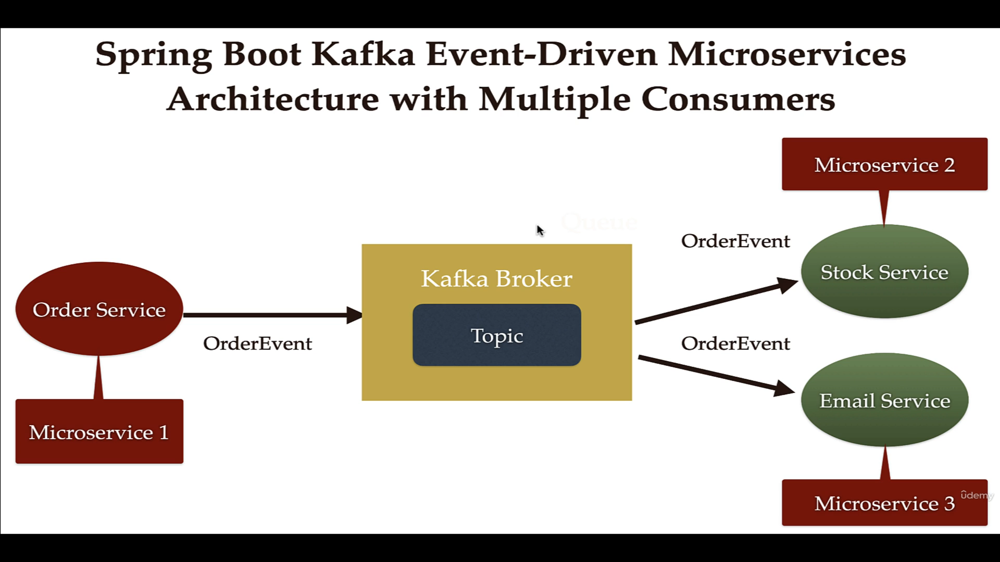
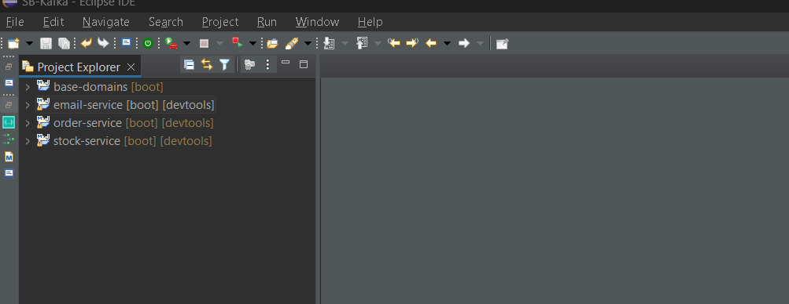

# Event Driven (Asynchronous) Architecture With Kafka 





## How Event Driven Architecture Works and It's Advantages






- Creating Projects: 



## Creating BaseDomain Project:
- This project will have all the base classes/Entities.
 i.e 
 ```

@Data
@AllArgsConstructor
@NoArgsConstructor
public class Order {

	private String orderId;
	private String name;
	private int qty;
	private double price;

}


@Data
@AllArgsConstructor
@NoArgsConstructor
public class OrderEvent {

	private String message;
	private	String status;
	private Order order;

}


- Now we will not create same classes/Entities in other project, but add this project as a dependency in other projects.

        <dependency>
			<groupId>com.example</groupId>
			<artifactId>base-domains</artifactId>
			<version>0.0.1-SNAPSHOT</version>
		    </dependency>

We can get this from `pom.xml`

 ```

## Creating a producer Order-Service : 

```
- Main Class :
@SpringBootApplication
public class OrderServiceApplication {

	public static void main(String[] args) {
		SpringApplication.run(OrderServiceApplication.class, args);
	}

}


- Configuration Layer :

@Configuration
public class KafkaTopicConfig {

	@Value("${spring.kafka.topic.name}")
	private String topicName;

	@Bean
	public NewTopic topic() {
		return TopicBuilder.name(topicName)
//				.partitions(3)
				.build();
	}
	
	

}


- Controller Layer :


@RestController
@RequestMapping("/api/v1")
public class OrderController {

	private OrderProducer orderProducer;

	public OrderController(OrderProducer orderProducer) {
		this.orderProducer = orderProducer;
	}

	@PostMapping("/orders")
	public String placeOrder(@RequestBody Order order) {
		order.setOrderId(UUID.randomUUID().toString());
		OrderEvent orderEvent = new OrderEvent();
		orderEvent.setStatus("PENDING");
		orderEvent.setOrder(order);
		orderEvent.setMessage("Order status is pending");
		orderProducer.sendMessage(orderEvent);

		return "Order Placed Successfully";
	}

}


- Service Layer :

import org.apache.kafka.clients.admin.NewTopic;
import org.springframework.beans.factory.annotation.Autowired;
import org.springframework.kafka.core.KafkaTemplate;
import org.springframework.kafka.support.KafkaHeaders;
import org.springframework.messaging.Message;
import org.springframework.messaging.support.MessageBuilder;
import org.springframework.stereotype.Service;

import com.example.base_domains.dto.OrderEvent;
@Service
@Slf4j
public class OrderProducer {

	@Autowired
	private NewTopic topic;
	@Autowired
	private KafkaTemplate<String, OrderEvent> kafkaTemplate;

	public void sendMessage(OrderEvent orderEvent) {
		log.info(String.format("OrderEvent sent -> %s", orderEvent));

//		1ST WAY SEND MESSAGE WITH TOPIC NAME
//		kafkaTemplate.send(topic.name(), orderEvent);

//		2ND WAY SEND MESSAGE WITH MESSAGE OBJECT AS PARAMETER
		// Send Message
		Message<OrderEvent> message = MessageBuilder.withPayload(orderEvent).setHeader(KafkaHeaders.TOPIC, topic.name())
				.build();

		kafkaTemplate.send(message);

	}

}


properties : 

spring.application.name=order-service


##Producer
spring.kafka.producer.bootstrap-servers=localhost:9092
spring.kafka.producer.key-serializer=org.apache.kafka.common.serialization.StringSerializer
#spring.kafka.producer.value-serializer=org.apache.kafka.common.serialization.StringSerializer
spring.kafka.producer.value-serializer=org.springframework.kafka.support.serializer.JsonSerializer
spring.kafka.topic.name=order_topics


```


## Creating Consumers : 


Add the dependency in `pom.xml` for both email and stock projects.

- 1. Email Project :
```
	<dependency>
			<groupId>com.example</groupId>
			<artifactId>base-domains</artifactId>
			<version>0.0.1-SNAPSHOT</version>
		</dependency>
```

```
- Main Class :

@SpringBootApplication
public class EmailServiceApplication {

	public static void main(String[] args) {
		SpringApplication.run(EmailServiceApplication.class, args);
	}

}

- Service Layer :

@Service
@Slf4j
public class EmailConsumer {

	@KafkaListener(topics = "${spring.kafka.topic.name}", groupId = "${spring.kafka.consumer.group-id}")
	public void consume(OrderEvent orderEvent) {
		log.info(String.format("OrderEvent received -> %s", orderEvent.toString()));

		// Send Mail
	}
}


- Properties :

spring.application.name=email-service


server.port=8082


spring.kafka.consumer.bootstrap-servers=localhost:9092
#The rule is that when ever there are multiple consumers which are consuming the data from a single topic, then they should have consumer different group ids. If there is only one consumer then we should use group id
#i.e one producers sending data to a single topic and multiple consumers i,e stock-service and email-service
spring.kafka.consumer.group-id=emailgroup
spring.kafka.consumer.auto-offset-reset=earliest
spring.kafka.consumer.key-deserializer=org.apache.kafka.common.serialization.StringDeserializer
#spring.kafka.consumer.value-deserializer=org.apache.kafka.common.serialization.StringDeserializer
##sending objects so value we are changing
spring.kafka.consumer.value-deserializer=org.springframework.kafka.support.serializer.JsonDeserializer
spring.kafka.consumer.properties.spring.json.trusted.packages=*
spring.kafka.topic.name=order_topics


```

- 2  Stock Project :

```
- Main Class


- Service Layer :
@Service
@Slf4j
public class OrderConsumer {

	@KafkaListener(topics = "${spring.kafka.topic.name}", groupId = "${spring.kafka.consumer.group-id}")
	public void consume(OrderEvent orderEvent) {
		log.info(String.format("OrderEvent received -> %s", orderEvent.toString()));
		
		//Save Order to Database
	}

}


- Properties :
spring.application.name=stock-service
server.port=8081


spring.kafka.consumer.bootstrap-servers=localhost:9092
#The rule is that when ever there are multiple consumers which are consuming the data from a single topic, then they should have consumer different group ids. If there is only one consumer then we should use group id
#i.e one producers sending data to a single topic and multiple consumers i,e stock-service and email-service
spring.kafka.consumer.group-id=stockgroup
spring.kafka.consumer.auto-offset-reset=earliest
spring.kafka.consumer.key-deserializer=org.apache.kafka.common.serialization.StringDeserializer
#spring.kafka.consumer.value-deserializer=org.apache.kafka.common.serialization.StringDeserializer
##sending objects so value we are changing
spring.kafka.consumer.value-deserializer=org.springframework.kafka.support.serializer.JsonDeserializer
spring.kafka.consumer.properties.spring.json.trusted.packages=*
spring.kafka.topic.name=order_topics


```


- Note base dependency in `pom.xml` for all projects. 

```
- API
    <dependency>
			<groupId>org.springframework.boot</groupId>
			<artifactId>spring-boot-starter-web</artifactId>
		</dependency>

- Kafka
        <dependency>
			<groupId>org.springframework.kafka</groupId>
			<artifactId>spring-kafka</artifactId>
		</dependency>

```


- Run all the projects and also run the zookeeper with the kafka broker in system and call the post api and send the object the object will be sent from order-service to the topic of the provided broker and consumer's email-service and stock-service will receive the object from the topic and process.