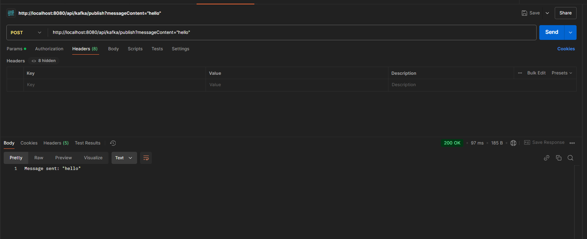
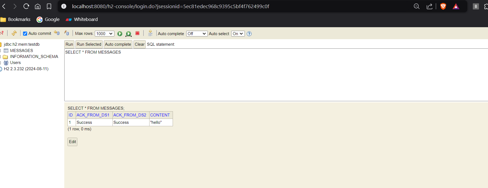

### **Flow of the Code**
Here's how the flow works step-by-step in your Kafka-driven system:

---

#### **1. Main Service Producer Sends a Message**
- **Action**: A message is published to `main-topic` via an HTTP POST request.
- **Database**: The message is stored in the H2 database with `ackFromDs1` and `ackFromDs2` set to `null`.
- **Kafka**: The message is sent to the Kafka `main-topic`.

---

#### **2. Downstream Consumers (ds1 and ds2) Process the Message**
- **Listener**: Both downstream consumers (`DownstreamConsumer1` and `DownstreamConsumer2`) listen to `main-topic`.
- **Processing**:
  - Each consumer processes the message independently.
  - After successful processing, each sends an acknowledgment message to the `ack-topic` in this format: 
    ```
    ds1-ack:Success for message - <message-content>
    ds2-ack:Success for message - <message-content>
    ```

---

#### **3. Main Service Consumer Updates the Database**
- **Listener**: The `MainServiceConsumer` listens to `ack-topic`.
- **Processing**:
  - It receives acknowledgment messages.
  - Based on the source (`ds1-ack` or `ds2-ack`), it updates the `ackFromDs1` or `ackFromDs2` field in the database for the corresponding message.
  - If both fields are updated with `"Success"`, the message is fully acknowledged.

---

#### **4. Final State in Database**
- After all acknowledgments are received, the database reflects the statuses:
  ```
  | ID  | Content       | Ack From Ds1 | Ack From Ds2 |
  |-----|---------------|--------------|--------------|
  | 1   | HelloKafka    | Success      | Success      |
  | 2   | HelloKafka1   | Success      | Success      |
  ```

---

### **Working Example Scenario**

#### **Input**:
1. Send a message, **HelloKafka**, from the main service.
   - POST: `http://localhost:8080/api/kafka/publish?message=HelloKafka`
   - Kafka publishes the message to `main-topic`.
   - H2 stores it as:
     ```
     | ID  | Content     | Ack From Ds1 | Ack From Ds2 |
     |-----|-------------|--------------|--------------|
     | 1   | HelloKafka  | null         | null         |
     ```

2. Downstream consumers process the message and send acknowledgments:
   - Consumer `ds1` sends: `ds1-ack:Success for message - HelloKafka`
   - Consumer `ds2` sends: `ds2-ack:Success for message - HelloKafka`

3. Main service receives these acknowledgments and updates the database:
   ```
   | ID  | Content     | Ack From Ds1 | Ack From Ds2 |
   |-----|-------------|--------------|--------------|
   | 1   | HelloKafka  | Success      | Success      |
   ```

---

### **Use Cases for This Design**

#### **1. Distributed Processing with Acknowledgments**
- When different downstream services (consumers) independently process parts of a message and the main service needs to know their success or failure.
- Example: A payment service sends a transaction for fraud analysis (Consumer 1) and audit logging (Consumer 2). Both must confirm success.

#### **2. Workflow Orchestration**
- If processing involves multiple stages, acknowledgments from each stage ensure that the workflow is complete.

#### **3. Tracking Message Processing**
- Using a database to store acknowledgment statuses allows for:
  - **Auditability**: You can track which messages were fully processed or stuck.
  - **Retries**: You can retry messages where acknowledgments are missing or failed.

#### **4. Reliable Event-Driven Systems**
- Acknowledgments ensure that messages are not lost or skipped in the pipeline, making it suitable for high-reliability systems like e-commerce orders or payment systems.

---

### **Scenarios Where This Design is Useful**

#### **1. Multi-Stage Processing**
- When a message must pass through multiple downstream systems or microservices that are decoupled.

#### **2. Dependency Management**
- If a task in the main service depends on the successful processing of the same message by multiple downstream systems.

#### **3. Failure Detection**
- By monitoring the acknowledgment fields, the main service can detect downstream failures or delays and take corrective actions.

#### **4. Decoupled Communication**
- Kafka topics allow for asynchronous, decoupled communication between services, making the architecture scalable and resilient.

---

### **Considerations for Real-World Use**
1. **Delayed Acknowledgments**:
   - Use a timeout or retry mechanism for downstream systems that do not respond within a certain time.

2. **Scaling Consumers**:
   - Ensure that `ack-topic` is partitioned and consumers are configured for scalability.

3. **Idempotency**:
   - Make sure downstream services and acknowledgment updates are idempotent to handle retries.

4. **Error Handling**:
   - Add error-handling mechanisms to handle cases where downstream services fail to process the message.

---

### **Additional Resources**

