# spring-kafka-avro-schema-registry

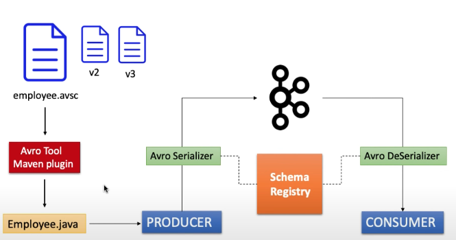

## Start the docker compose ```docker-compose up -d`` :


```

services:
  zookeeper:
    image: confluentinc/cp-zookeeper:5.4.0
    hostname: zookeeper
    container_name: zookeeper
    ports:
      - "2181:2181"
    environment:
      ZOOKEEPER_CLIENT_PORT: 2181
      ZOOKEEPER_TICK_TIME: 2000

  broker:
    image: confluentinc/cp-server:5.4.0
    hostname: broker
    container_name: broker
    depends_on:
      - zookeeper
    ports:
      - "9092:9092"
    environment:
      KAFKA_BROKER_ID: 1
      KAFKA_ZOOKEEPER_CONNECT: "zookeeper:2181"
      KAFKA_LISTENER_SECURITY_PROTOCOL_MAP: PLAINTEXT:PLAINTEXT,PLAINTEXT_HOST:PLAINTEXT
      KAFKA_ADVERTISED_LISTENERS: PLAINTEXT://broker:29092,PLAINTEXT_HOST://localhost:9092
      KAFKA_METRIC_REPORTERS: io.confluent.metrics.reporter.ConfluentMetricsReporter
      KAFKA_OFFSETS_TOPIC_REPLICATION_FACTOR: 1
      KAFKA_GROUP_INITIAL_REBALANCE_DELAY_MS: 0
      KAFKA_CONFLUENT_LICENSE_TOPIC_REPLICATION_FACTOR: 1
      CONFLUENT_METRICS_REPORTER_BOOTSTRAP_SERVERS: broker:29092
      CONFLUENT_METRICS_REPORTER_ZOOKEEPER_CONNECT: zookeeper:2181
      CONFLUENT_METRICS_REPORTER_TOPIC_REPLICAS: 1
      CONFLUENT_METRICS_ENABLE: "true"
      CONFLUENT_SUPPORT_CUSTOMER_ID: "anonymous"

  kafka-tools:
    image: confluentinc/cp-kafka:5.4.0
    hostname: kafka-tools
    container_name: kafka-tools
    command: ["tail", "-f", "/dev/null"]
    network_mode: "host"

  schema-registry:
    image: confluentinc/cp-schema-registry:5.4.0
    hostname: schema-registry
    container_name: schema-registry
    depends_on:
      - zookeeper
      - broker
    ports:
      - "8081:8081"
    environment:
      SCHEMA_REGISTRY_HOST_NAME: schema-registry
      SCHEMA_REGISTRY_KAFKASTORE_CONNECTION_URL: "zookeeper:2181"

  control-center:
    image: confluentinc/cp-enterprise-control-center:5.4.0
    hostname: control-center
    container_name: control-center
    depends_on:
      - zookeeper
      - broker
      - schema-registry
    ports:
      - "9021:9021"
    environment:
      CONTROL_CENTER_BOOTSTRAP_SERVERS: 'broker:29092'
      CONTROL_CENTER_ZOOKEEPER_CONNECT: 'zookeeper:2181'
      CONTROL_CENTER_SCHEMA_REGISTRY_URL: "http://schema-registry:8081"
      CONTROL_CENTER_REPLICATION_FACTOR: 1
      CONTROL_CENTER_INTERNAL_TOPICS_PARTITIONS: 1
      CONTROL_CENTER_MONITORING_INTERCEPTOR_TOPIC_PARTITIONS: 1
      CONFLUENT_METRICS_TOPIC_REPLICATION: 1
      PORT: 9021

```


- Check out the control center: 
URL: http://localhost:9021
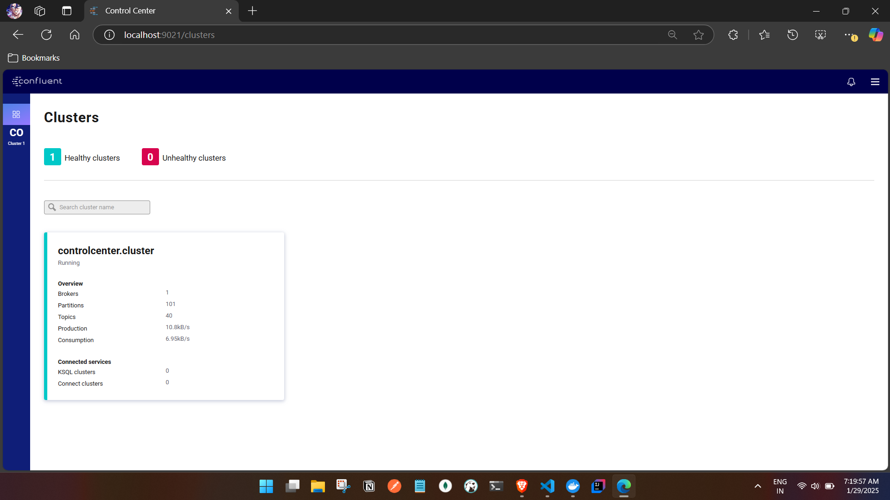
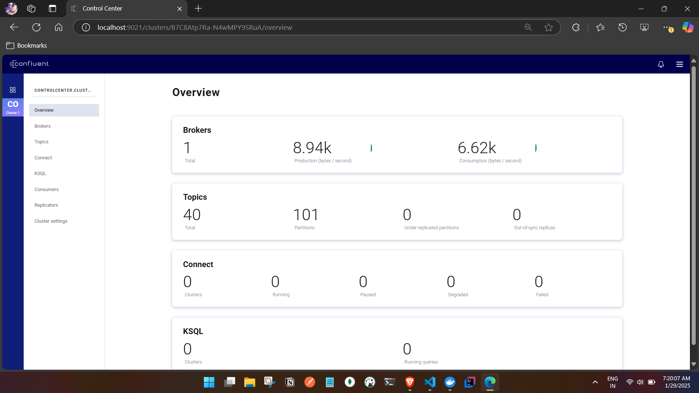
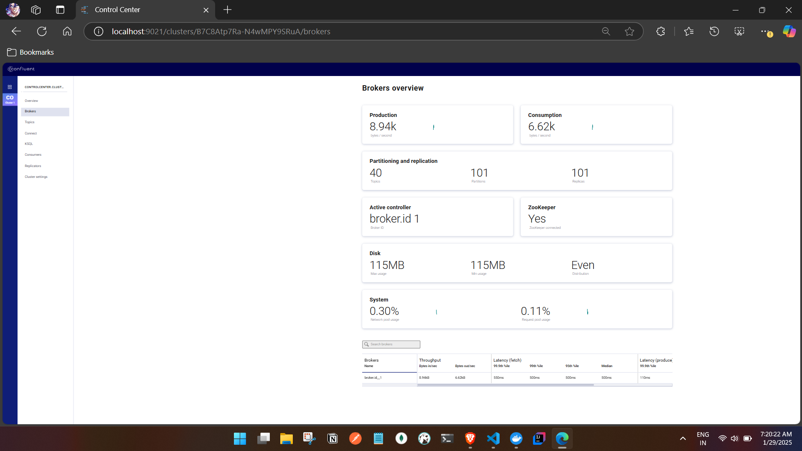
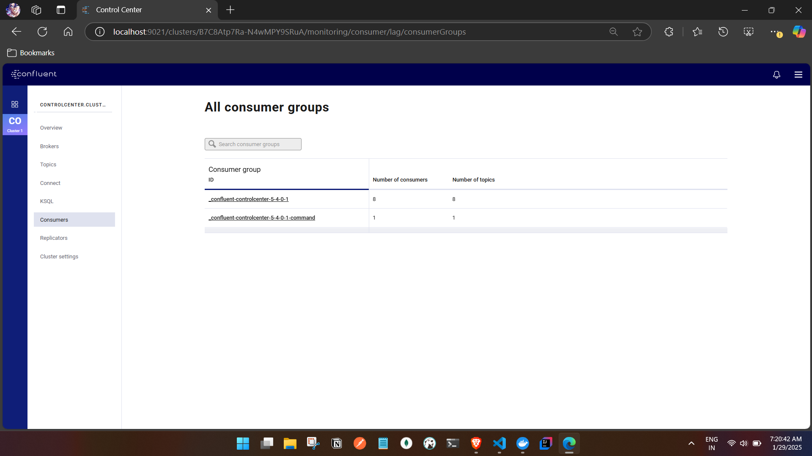
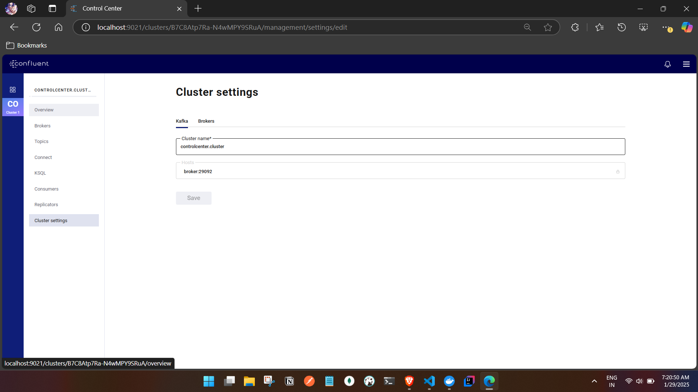

### Create the schema.   
- Create a file ``src\main\resources\avro\employee.avsc``. 
- .avsc is the extension for avro schema.
- and inside the file we need to define:
  - the package-name where we need to keep the genrated class.
  - the type: record like an avro-record.
  - the class-name: Employee.
  - Need to define all the files which i need to produce and consume, we will define the feild array:
  - field = [{name:nameOfTheFeild, type:typeofTheFeild}] 
  - for optional feilds we need to add the default value in feild object as:"", empty string
  - our schema 
  


```
  {
  "namespace": "com.javatechie.dto",
  "type": "record",
  "name": "Employee",
  "fields": [
    {
      "name": "id",
      "type": "string"
    },
    {
      "name": "firstName",
      "type": "string"
    },
    {
      "name": "middleName",
      "type": "string",
      "default": ""
    },
    {
      "name": "lastName",
      "type": "string"
    },
    {
      "name": "emailId",
      "type": "string",
      "default": ""
    }
  ]
  }
```

### We need to generate the java classes from avro schema.
- Use the avro-maven-plugin.
- add dependency in pom.xml
```
<dependency>
			<groupId>io.confluent</groupId>
			<artifactId>kafka-avro-serializer</artifactId>
			<version>7.4.0</version>
		</dependency>

		<dependency>
			<groupId>io.confluent</groupId>
			<artifactId>kafka-schema-registry-client</artifactId>
			<version>7.4.0</version>
		</dependency>

		<dependency>
			<groupId>org.apache.avro</groupId>
			<artifactId>avro</artifactId>
			<version>1.11.0</version>
		</dependency>


    - Add the plugin in plugins section in pom.xml

    <plugin>
				<groupId>org.apache.avro</groupId>
				<artifactId>avro-maven-plugin</artifactId>
				<version>1.8.2</version>
				<executions>
					<execution>
						<id>schemas</id>
						<phase>generate-sources</phase>
						<goals>
							<goal>schema</goal>
						</goals>
						<configuration>
							<sourceDirectory>${project.basedir}/src/main/resources/</sourceDirectory>
							<outputDirectory>${project.basedir}/src/main/java/</outputDirectory>
						</configuration>
					</execution>
				</executions>
			</plugin>
``` 


- Note this dependency are not present in maven-central repository so we need to load them from confluent repository.

- Add repository in pom.xml
```
<repositories>
		<repository>
			<id>confluent</id>
			<url>https://packages.confluent.io/maven/</url>
		</repository>
	</repositories>
```
- Clean install the project and the Java class will be auto generated by Avro.
- Our Employee class.

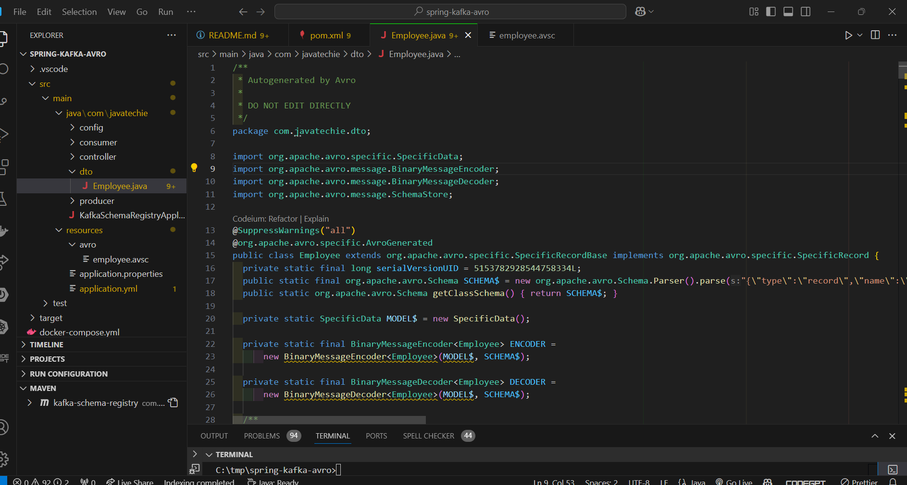


- application.properties 
- here we will define the avro serializer for producer and avro deserializer for consumer.
- we will specify the schema registry url for producer and consumer.
- we will specify the specific avro reader true for consumer. 


```
topic:
  name: javatechie-avro

server:
  port: 8182


spring:
  kafka:
    bootstrap-servers: "127.0.0.1:9092"
    producer:
      keySerializer: "org.apache.kafka.common.serialization.StringSerializer"
      valueSerializer: "io.confluent.kafka.serializers.KafkaAvroSerializer"
      properties:
        schema:
          registry:
            url: "http://127.0.0.1:8081"
    consumer:
      group-id: "javatechie-new"
      keyDeserializer: "org.apache.kafka.common.serialization.StringDeserializer"
      valueDeserializer: "io.confluent.kafka.serializers.KafkaAvroDeserializer"
      autoOffsetReset: "earliest"
      properties:
        schema:
          registry:
            url: "http://127.0.0.1:8081"
        specific:
          avro:
            reader: "true"

```

### Now we need to produce the message and consume the message.

- Create a topic name from config:
```

@Configuration
public class KafkaConfig {

    @Value("${topic.name}")
    private String topicName;

    @Bean
    public NewTopic createTopic(){
        return new NewTopic(topicName, 3, (short) 1);
    }
}

```
- Create a service which sends data to topic.
```

@Service
public class KafkaAvroProducer {

    @Value("${topic.name}")
    private String topicName;

    @Autowired
    private KafkaTemplate<String, Employee> template;


    public void send(Employee employee){
        CompletableFuture<SendResult<String, Employee>> future = template.send(topicName, UUID.randomUUID().toString(),employee);
        future.whenComplete((result, ex) -> {
            if (ex == null) {
                System.out.println("Sent message=[" + employee +
                        "] with offset=[" + result.getRecordMetadata().offset() + "]");
            } else {
                System.out.println("Unable to send message=[" +
                        employee + "] due to : " + ex.getMessage());
            }
        });
    }
}

```
- Create a controller which will send the message to topic.
```
@RestController
public class EventController {
    @Autowired
    private KafkaAvroProducer producer;

    @PostMapping("/events")
    public String sendMessage(@RequestBody Employee employee) {
        producer.send(employee);
        return "message published !";
    }
}

```
- Create a consumer which will consume the message from topic.

```
@Service
@Slf4j
public class KafkaAvroConsumer {

    @KafkaListener(topics = "${topic.name}")
    public void read(ConsumerRecord<String, Employee> consumerRecord) {
        String key = consumerRecord.key();
        Employee employee = consumerRecord.value();
        log.info("Avro message received for key : " + key + " value : " + employee.toString());

    }
}

```
- We are consuming the data from ConsumerRecord it stores like key and value and its similiar to producerRecord while sending from producer.

- start the application.
- control center: http://localhost:9021

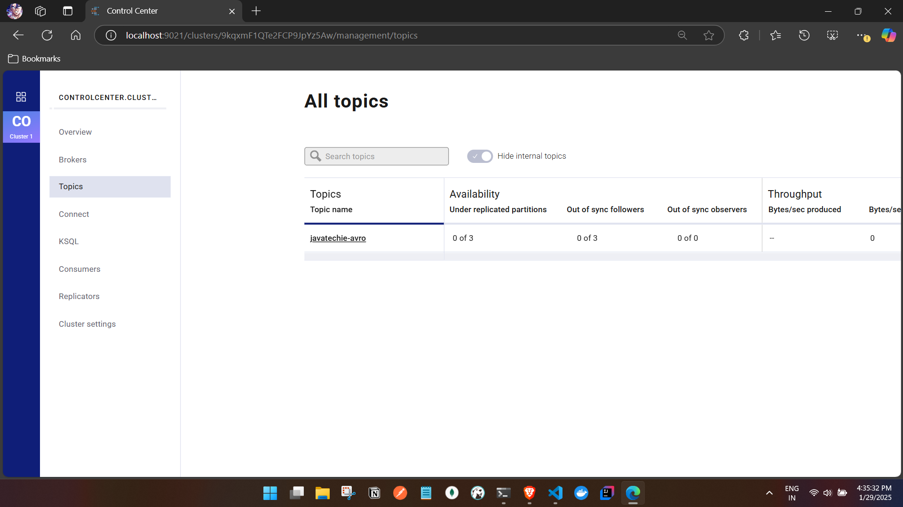
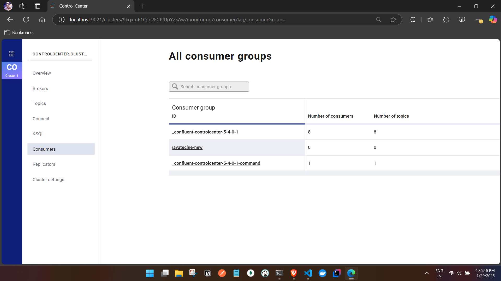
- and in our topic we are not seeing any schema registered.
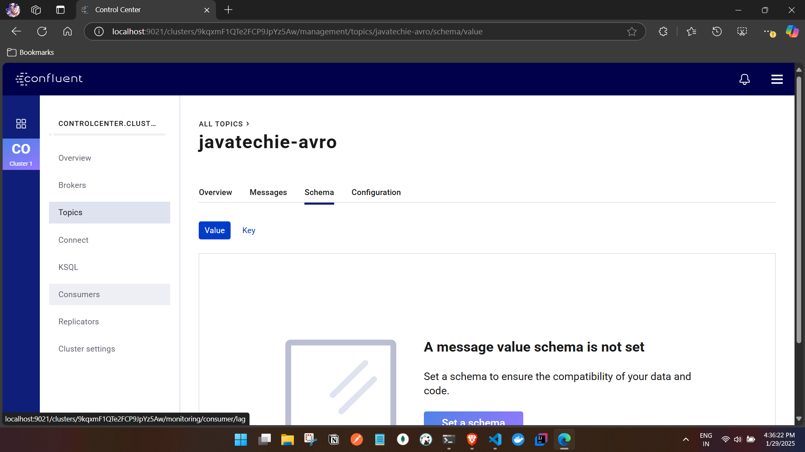
- in order to do that the data must be serialized so we need to send the employee object data to the api endpoint.

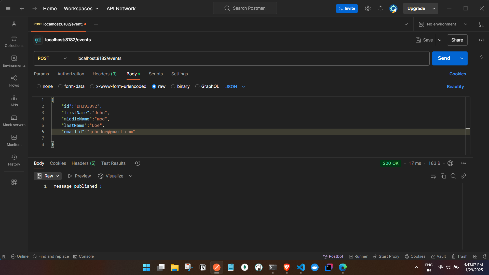

- logs:
```
Sent message=[{"id": "DHJ93092", "firstName": "John", "middleName": "mod", "lastName": "Doe", "emailId": "johndoe@gmail.com"}] with offset=[0]
2025-01-29T16:42:08.485+05:30  INFO 36120 --- [ntainer#0-0-C-1] c.javatechie.consumer.KafkaAvroConsumer  : Avro message received for key : da5cf26e-cf6e-4261-84a0-13a90342d95a value : {"id": "DHJ93092", "firstName": "John", "middleName": "mod", "lastName": "Doe", "emailId": "johndoe@gmail.com"}


```

- Checking the schema for out topic in the control center:
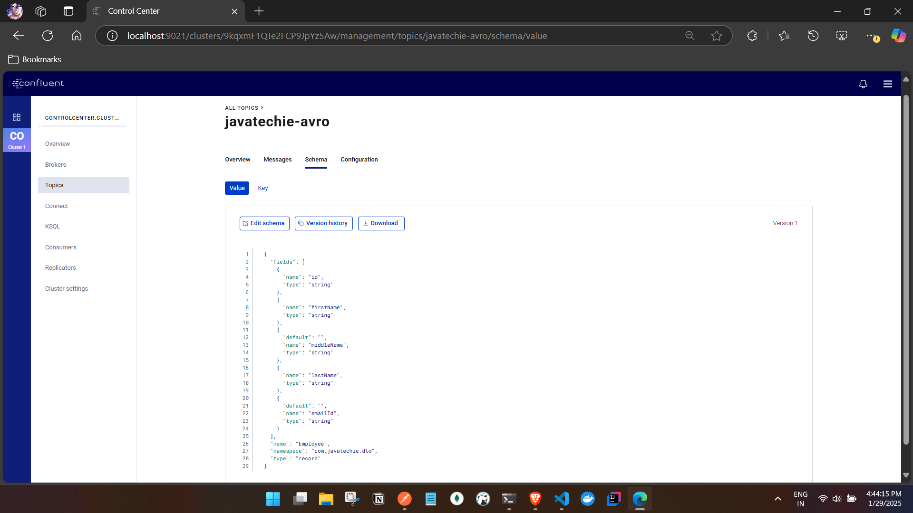
- In schema registry url :``http://127.0.0.1:8081/subjects``:

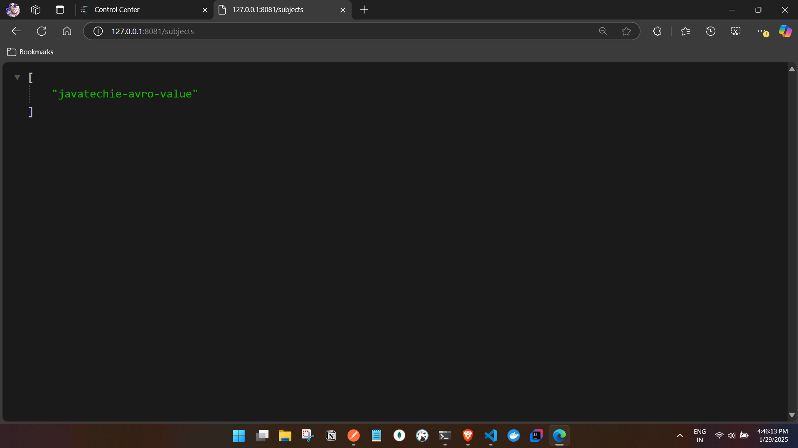
- post publishing the data we can see in control-centre:
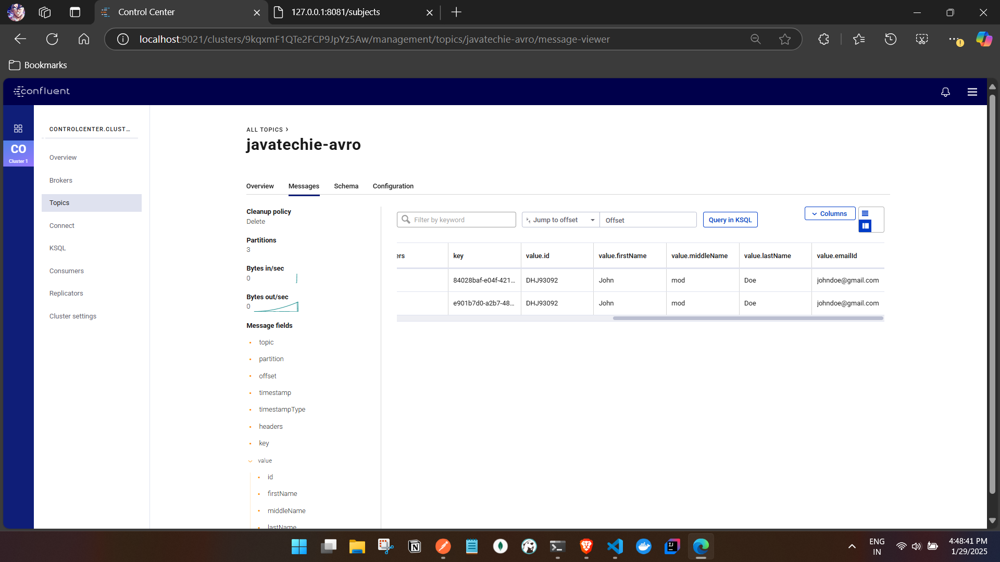
- checking out the schema version ``http://127.0.0.1:8081/subjects/javatechie-avro-value/versions/latest``
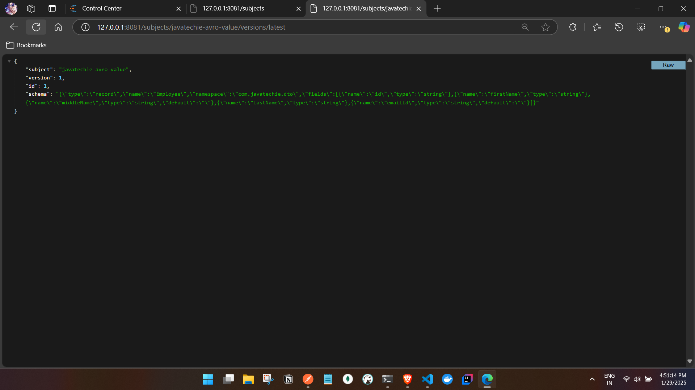

### Case 1 modifying the schema i.e employee.avsc remove the emailId field.

  {
      "name": "emailId",
      "type": "string",
      "default": ""
    }

- Clean install the project and go to the postman update the fields and call the api


- logs :

```
Sent message=[{"id": "DHJ93092d", "firstName": "Jdohn", "middleName": "mod", "lastName": "Dose"}] with offset=[1]
2025-01-29T17:06:26.897+05:30  INFO 24732 --- [ntainer#0-0-C-1] c.javatechie.consumer.KafkaAvroConsumer  : Avro message received for key : f8cb1718-4cf2-4566-953b-afd4dc1c8a61 value : {"id": "DHJ93092d", "firstName": "Jdohn", "middleName": "mod", "lastName": "Dose"}    

```
- schema:
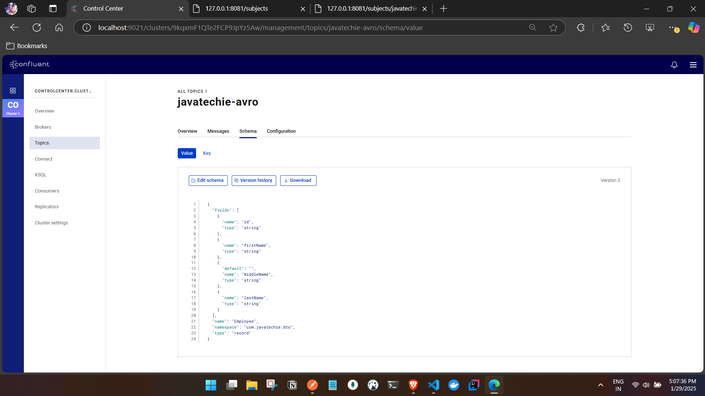
- versions:
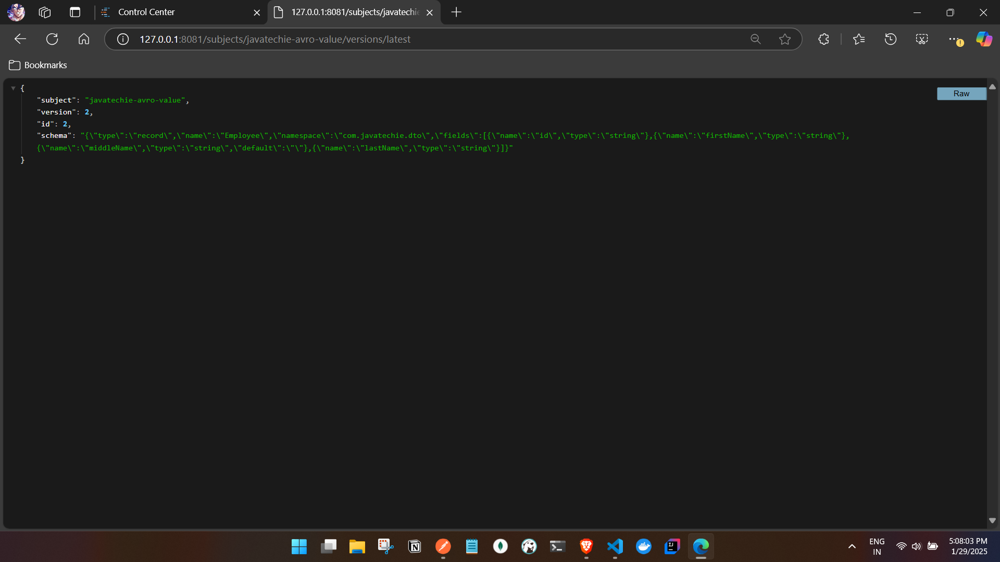
- version history:
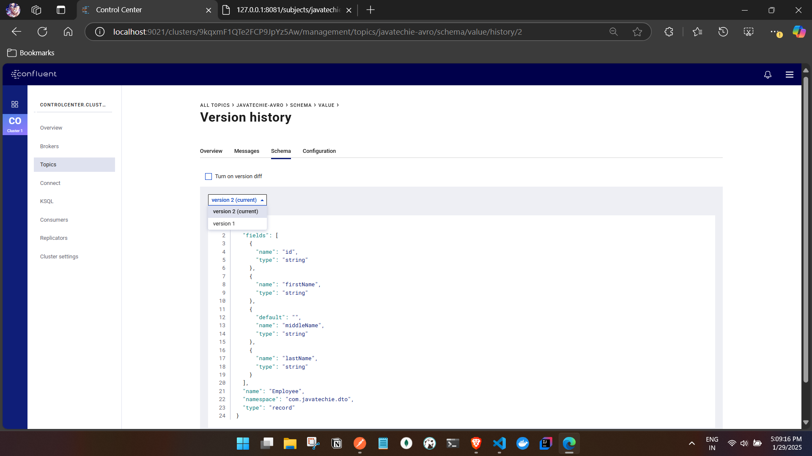
- working fine.

### Case 2 adding a field:
when we add a new field in the schema file and follow the same above process we will see an error stating schema incompatible with earlier schema.
- so the work-around is initially make the field as default i,e 

add a new field called dob in schema in below format.

{
  "name":"dob",
  "type":"string",
  "default":""
}

- and test out as abouve , clean install , start the code update the payload and submit the data to the api.

- post clean install we can see our employee class being updated for eg:
```
   * @param id The new value for id
   * @param firstName The new value for firstName
   * @param middleName The new value for middleName
   * @param lastName The new value for lastName
   * @param dob The new value for dob
```

- Testing the api
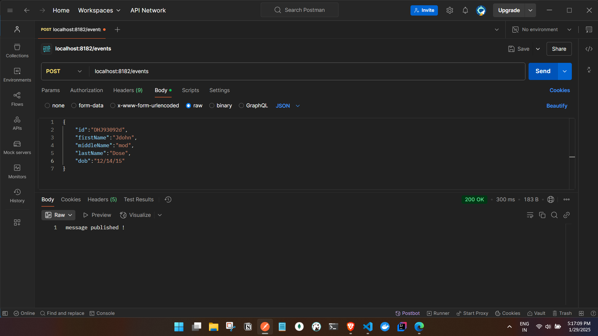

- control-centre UI:
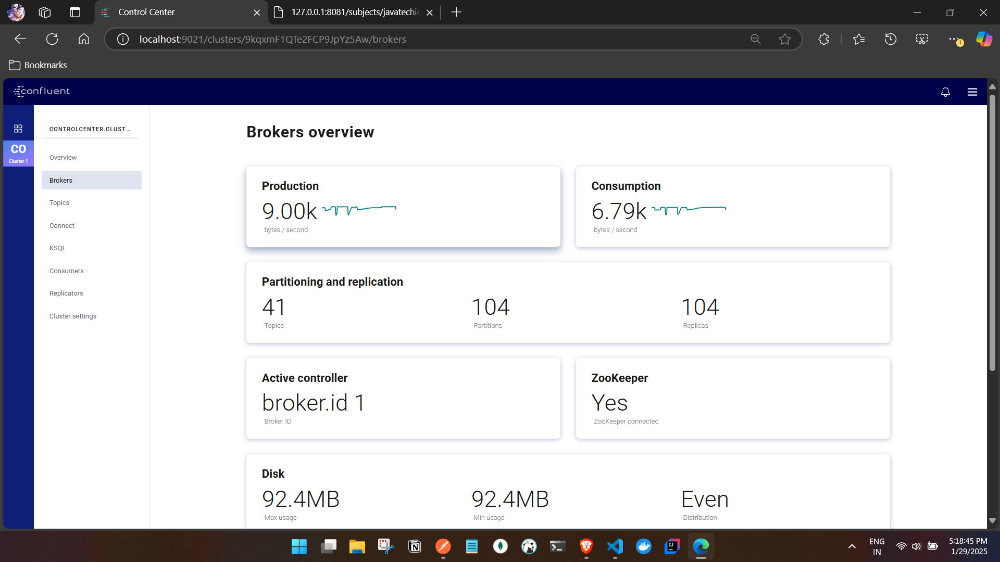
- data :
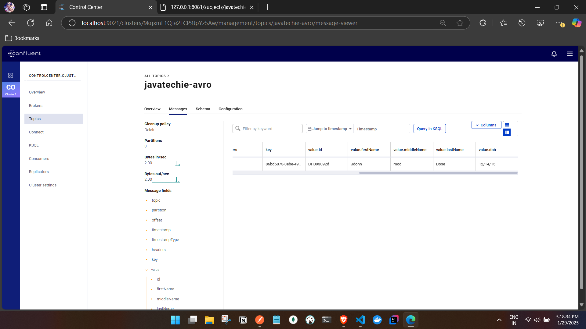
- schema:
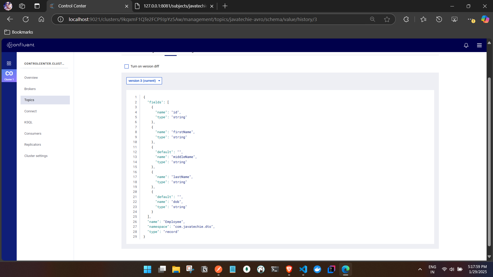

- schema version:
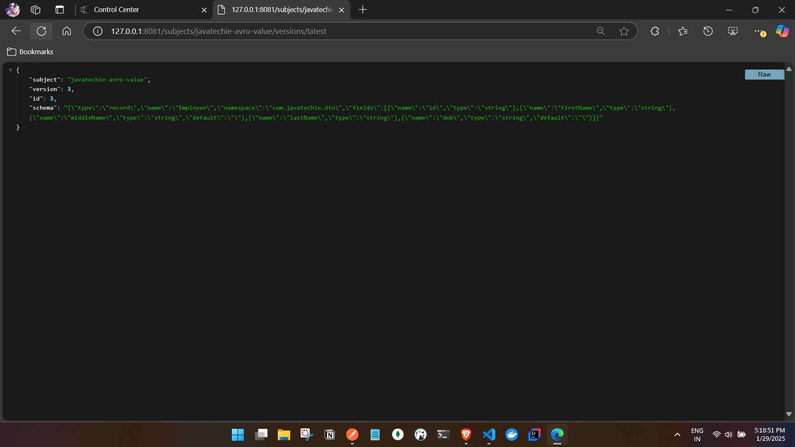

- working fine.