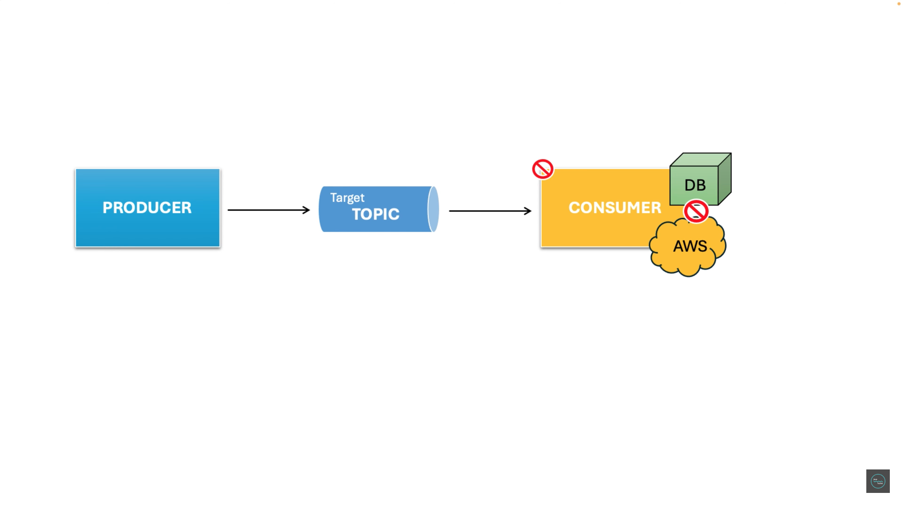
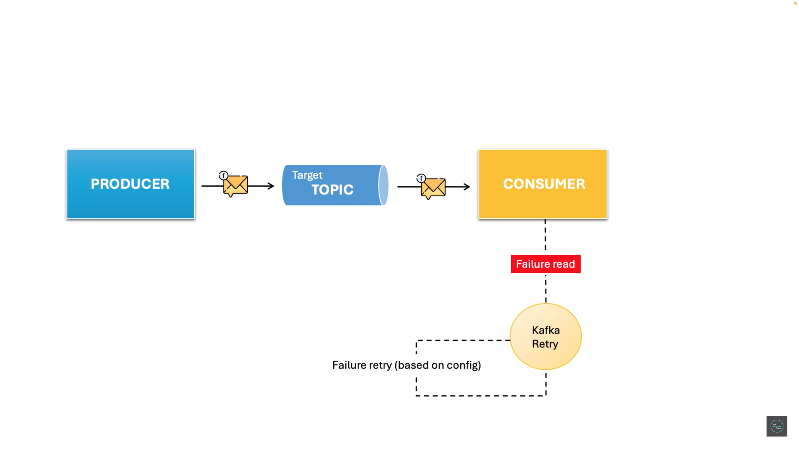
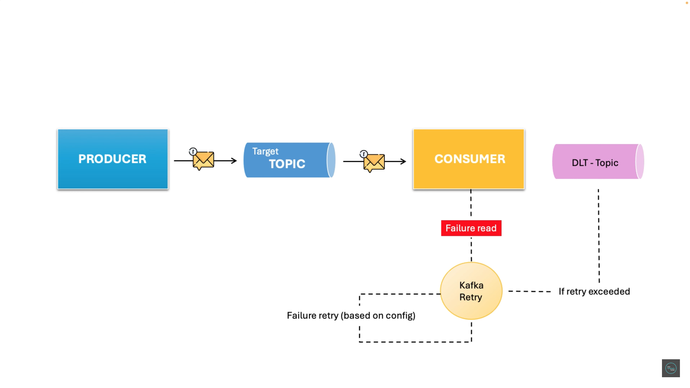
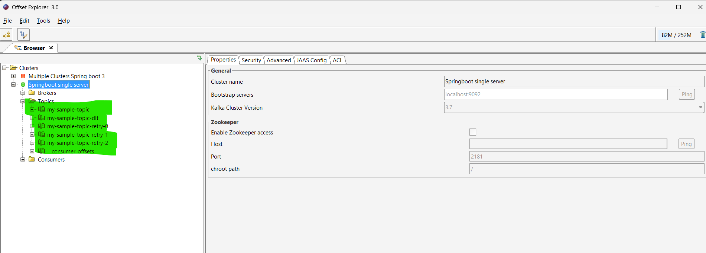
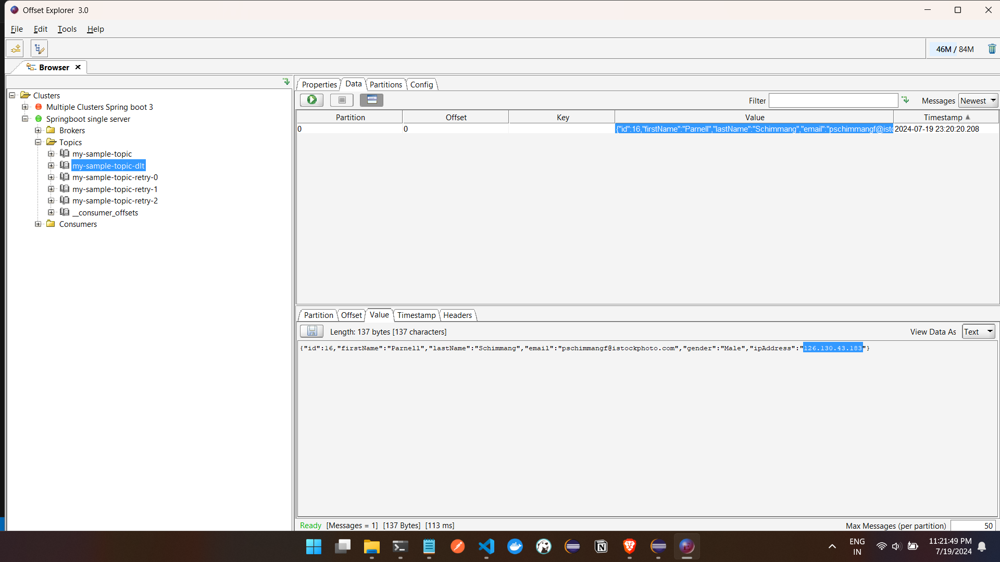
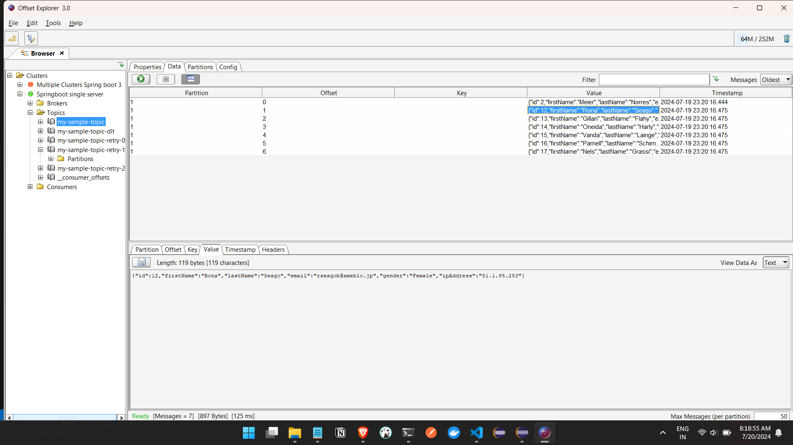
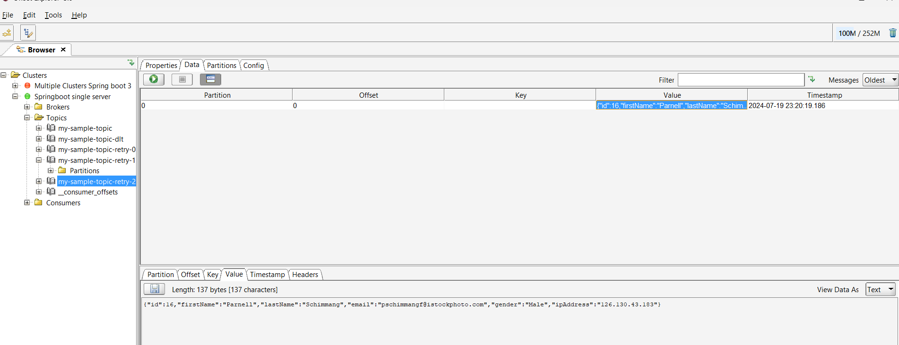
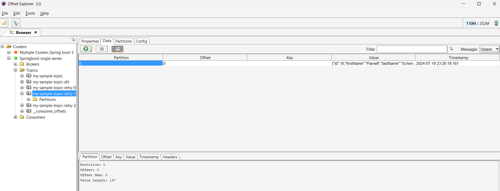
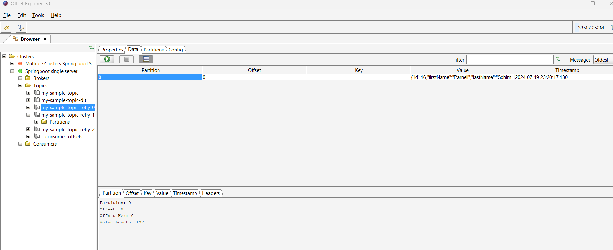

While sending the data to the consumer, if the DB or infrastructure is not available or facing any issues at that time,
so there will be a risk of lossing data so we have to ensure that we dont loose any data .




We will see the diffrent ways to handle this issues :


so for eg , we are sending data and in case of failure we have to configure retry mechanism and how many times to retry we have to confihure
so if we make retry as 4 ,so kafka will make retry attempts 3 (n-1) times 




if retry is exceeded the messages or data is send to DLT (dead letter topic ) topic
so basically its a topic which will store all the data which was failed events
so when data is not processed even after retry those data is pushed to DLT topic 




After Adding the DLT and retry config we had configured 4 retry so 0 , 1, 2  retry topics we got and also we got one dlt topic which will listen if the retry exceeds 3 times 


so im our sample error situation which will fail for an single IP 

LOGS :

```


First Sending

2024-07-19T23:09:58.626+05:30  INFO 86900 --- [ntainer#0-0-C-1] c.ashfaq.consumer.KafkaMessageConsumer   : Received: {"id":16,"firstName":"Parnell","lastName":"Schimmang","email":"pschimmangf@istockphoto.com","gender":"Male","ipAddress":"126.130.43.183"} from my-sample-topic offset 15
2024-07-19T23:09:59.134+05:30  INFO 86900 --- [ad | producer-1] org.apache.kafka.clients.Metadata        : [Producer clientId=producer-1] Resetting the last seen epoch of partition my-sample-topic-retry-0-0 to 0 since the associated topicId changed from null to HzGY9bvpTQ6QlApRnsuk9A
2024-07-19T23:09:59.134+05:30  INFO 86900 --- [ntainer#0-0-C-1] o.a.k.clients.consumer.KafkaConsumer     : [Consumer clientId=consumer-my-group-5, groupId=my-group] Seeking to offset 16 for partition my-sample-topic-0
2024-07-19T23:09:59.134+05:30  INFO 86900 --- [0-retry-0-0-C-1] o.a.k.clients.consumer.KafkaConsumer     : [Consumer clientId=consumer-my-group-retry-0-4, groupId=my-group-retry-0] Seeking to offset 4 for partition my-sample-topic-retry-0-0

Then failure 

then retry 3 times :

2024-07-19T23:09:59.652+05:30  INFO 86900 --- [0-retry-0-0-C-1] c.ashfaq.consumer.KafkaMessageConsumer   : Received: {"id":16,"firstName":"Parnell","lastName":"Schimmang","email":"pschimmangf@istockphoto.com","gender":"Male","ipAddress":"126.130.43.183"} from my-sample-topic-retry-0 offset 4
2024-07-19T23:10:00.156+05:30  INFO 86900 --- [ad | producer-1] org.apache.kafka.clients.Metadata        : [Producer clientId=producer-1] Resetting the last seen epoch of partition my-sample-topic-retry-1-0 to 0 since the associated topicId changed from null to 8amvwkIrQoCr69flrC1n5Q
2024-07-19T23:10:00.156+05:30  INFO 86900 --- [0-retry-1-0-C-1] o.a.k.clients.consumer.KafkaConsumer     : [Consumer clientId=consumer-my-group-retry-1-3, groupId=my-group-retry-1] Seeking to offset 4 for partition my-sample-topic-retry-1-0

2024-07-19T23:10:00.676+05:30  INFO 86900 --- [0-retry-1-0-C-1] c.ashfaq.consumer.KafkaMessageConsumer   : Received: {"id":16,"firstName":"Parnell","lastName":"Schimmang","email":"pschimmangf@istockphoto.com","gender":"Male","ipAddress":"126.130.43.183"} from my-sample-topic-retry-1 offset 4
2024-07-19T23:10:01.181+05:30  INFO 86900 --- [ad | producer-1] org.apache.kafka.clients.Metadata        : [Producer clientId=producer-1] Resetting the last seen epoch of partition my-sample-topic-retry-2-0 to 0 since the associated topicId changed from null to 5_rEBXToT22vqy2kj79Gmg
2024-07-19T23:10:01.185+05:30  INFO 86900 --- [0-retry-2-0-C-1] o.a.k.clients.consumer.KafkaConsumer     : [Consumer clientId=consumer-my-group-retry-2-2, groupId=my-group-retry-2] Seeking to offset 4 for partition my-sample-topic-retry-2-0

2024-07-19T23:10:01.692+05:30  INFO 86900 --- [0-retry-2-0-C-1] c.ashfaq.consumer.KafkaMessageConsumer   : Received: {"id":16,"firstName":"Parnell","lastName":"Schimmang","email":"pschimmangf@istockphoto.com","gender":"Male","ipAddress":"126.130.43.183"} from my-sample-topic-retry-2 offset 4
2024-07-19T23:10:01.692+05:30 ERROR 86900 --- [0-retry-2-0-C-1] k.r.DeadLetterPublishingRecovererFactory : Record: topic = my-sample-topic-retry-2, partition = 0, offset = 4, main topic = my-sample-topic threw an error at topic my-sample-topic-retry-2 and won't be retried. 

sendig data to DLT

Sending to DLT with name my-sample-topic-dlt.

	at org.springframework.kafka.listener.KafkaMessageListenerContainer$ListenerConsumer.doInvokeWithRecords(KafkaMessageListenerContainer.java:2672) ~[spring-kafka-3.0.9.jar:3.0.9]
	at org.springframework.kafka.listener.KafkaMessageListenerContainer$ListenerConsumer.invokeRecordListener(KafkaMessageListenerContainer.java:2558) ~[spring-kafka-3.0.9.jar:3.0.9]
	at org.springframework.kafka.listener.KafkaMessageListenerContainer$ListenerConsumer.invokeListener(KafkaMessageListenerContainer.java:2200) ~[spring-kafka-3.0.9.jar:3.0.9]
	at org.springframework.kafka.listener.KafkaMessageListenerContainer$ListenerConsumer.invokeIfHaveRecords(KafkaMessageListenerContainer.java:1555) ~[spring-kafka-3.0.9.jar:3.0.9]
	at org.springframework.kafka.listener.KafkaMessageListenerContainer$ListenerConsumer.pollAndInvoke(KafkaMessageListenerContainer.java:1519) ~[spring-kafka-3.0.9.jar:3.0.9]
	at org.springframework.kafka.listener.KafkaMessageListenerContainer$ListenerConsumer.run(KafkaMessageListenerContainer.java:1394) ~[spring-kafka-3.0.9.jar:3.0.9]
	at java.base/java.util.concurrent.CompletableFuture$AsyncRun.run(CompletableFuture.java:1804) ~[na:na]
	at java.base/java.lang.Thread.run(Thread.java:1583) ~[na:na]
Caused by: org.springframework.kafka.listener.TimestampedException: E

2024-07-19T23:10:02.195+05:30  INFO 86900 --- [ad | producer-1] org.apache.kafka.clients.Metadata        : [Producer clientId=producer-1] Resetting the last seen epoch of partition my-sample-topic-dlt-0 to 0 since the associated topicId changed from null to XNdoGW_1Rbict83HyapLbg
2024-07-19T23:10:02.195+05:30  INFO 86900 --- [ner#0-dlt-0-C-1] c.ashfaq.consumer.KafkaMessageConsumer   : DLT recieved : my-sample-topic-dlt , from 4 , offset {}  User(id=16, firstName=Parnell, lastName=Schimmang, email=pschimmangf@istockphoto.com, gender=Male, ipAddress=126.130.43.183)


 ```

 This was the IP which will not be processed and will throw runtimeException

 retry 3 times -> but again will throw runtimeException

the this data will be pushed to DLT  topic 



- data 

```
{"id":16,"firstName":"Parnell","lastName":"Schimmang",
"email":"pschimmangf@istockphoto.com",
"gender":"Male",
"ipAddress":"126.130.43.183"}

```


and if you see the main topic that data will not be there 




as retry topics are there the data can be found in them 





### But if we see we are doing continusly the retry  : there should be some time gap  so we have to provide backoff 

```
@RetryableTopic(attempts = "4",backoff = @Backoff(delay = 3000, multiplier = 1.5 ,maxDelay = 15000))
	// 4 means it will try 3 times , and default count is 3
	//delay explained 1st retry after 3 secs, 2nd retry after 6.75 secs, 3rd retry after 10.125 secs because of multiplier 6.75 seconds * 1.5
	//If any retry delay calculation exceeds 15 seconds, the delay will be capped at 15 seconds due to the maxDelay parameter.

```


### Also We can sprecify for what type of exception we can retry  and dont retry :

```

	@RetryableTopic(attempts = "4",backoff = @Backoff(delay = 3000, multiplier = 1.5 ,maxDelay = 15000) ,
	
	include = {RuntimeException.class, UnknownHostException.class} , 
	<!-- OR else java.lang.IllegalArgumentException: Please use only retryOn() or only notRetryOn()  -->
			exclude = {NullPointerException.class} )

//	NOTE : error can be seen Caused by: java.lang.IllegalArgumentException: Please use only retryOn() or only notRetryOn() 
//	when we use both include and exclude so use one 


```


### The @RetryableTopic annotation in Spring Kafka offers several other parameters and configurations to fine-tune the retry behavior. Here's a brief overview of the key parameters:

Key Parameters


- dltTopicSuffix:

Specifies the suffix for the Dead Letter Topic (DLT). Messages that fail after all retry attempts will be sent to this topic.
autoStartDltHandler:

If set to true, it automatically starts the DLT handler.

- exclude:

Specifies the exceptions to exclude from retry. If an excluded exception is thrown, retries will not be attempted.

- include:

Specifies the exceptions to include for retry. Only these exceptions will trigger retries.

- timeout:

Specifies the maximum time in milliseconds to wait for a retry attempt before timing out.

- fixedDelayTopicStrategy:

If enabled, it uses a fixed delay strategy instead of an exponential backoff for retries.

- fixedDelayTopicSuffix:

Specifies the suffix for the fixed delay topic.

- kafkaTemplate:

Specifies a custom KafkaTemplate bean to use for retry operations.

- retryableExceptions:

Specifies the list of exceptions that should trigger retries.

- nonRetryableExceptions:

Specifies the list of exceptions that should not trigger retries.

- retryTimeout:

Specifies the total time allowed for retries. If the retries exceed this timeout, the message will be sent to the DLT.

- timeoutSuffix:

Specifies the suffix to use for timeout topics.

- timeoutStrategy:

Specifies the strategy to use when a timeout occurs (e.g., forwarding to a timeout topic).

- singleTopic:

If set to true, all retries will be sent to a single retry topic instead of creating multiple retry topics.