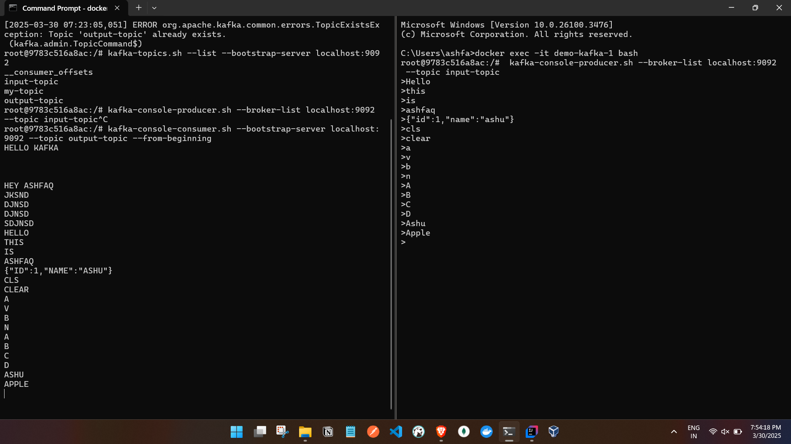

# Spring Boot + Kafka Streams Project:

Kafka Streams is a Java library for processing real-time data streams from Kafka topics. It lets we build event-driven applications that can filter, transform, aggregate, or join data streams without needing a separate cluster (like Spark or Flink). Since we already know Kafka basics, we’ll pick this up fast.

### **Why Kafka Streams?**
- **No separate cluster** – Runs as part of our Spring Boot app.
- **Stateful processing** – It can maintain state across events.
- **Windowing & Joins** – Supports time-based aggregations and combining streams.
- **Fault-tolerant** – Stores intermediate results in Kafka, ensuring recovery.

---

### **Spring Boot + Kafka Streams Setup**
We’ll create a simple app that:
1. Reads from an **input topic**.
2. Transforms the data.
3. Writes to an **output topic**.

---

### **1️⃣ Add Dependencies**
In `pom.xml`:
```xml
<dependency>
    <groupId>org.springframework.boot</groupId>
    <artifactId>spring-boot-starter</artifactId>
</dependency>

<dependency>
    <groupId>org.springframework.kafka</groupId>
    <artifactId>spring-kafka</artifactId>
</dependency>

<dependency>
    <groupId>org.apache.kafka</groupId>
    <artifactId>kafka-streams</artifactId>
</dependency>
```

---

### **2️⃣ Configure Kafka Streams**
In `application.yml`:
```yaml
spring:
  kafka:
    bootstrap-servers: localhost:9092
    streams:
      application-id: kafka-stream-app
```

---

### **3️⃣ Create Kafka Stream Processor**
```java
import org.apache.kafka.common.serialization.Serdes;
import org.apache.kafka.streams.KafkaStreams;
import org.apache.kafka.streams.StreamsBuilder;
import org.apache.kafka.streams.StreamsConfig;
import org.apache.kafka.streams.kstream.KStream;
import org.springframework.context.annotation.Bean;
import org.springframework.context.annotation.Configuration;

import java.util.Properties;

@Configuration
public class KafkaStreamConfig {

    @Bean
    public KafkaStreams kafkaStreams() {
        Properties props = new Properties();
        props.put(StreamsConfig.APPLICATION_ID_CONFIG, "stream-app");
        props.put(StreamsConfig.BOOTSTRAP_SERVERS_CONFIG, "localhost:9092");
        props.put(StreamsConfig.DEFAULT_KEY_SERDE_CLASS_CONFIG, Serdes.String().getClass());
        props.put(StreamsConfig.DEFAULT_VALUE_SERDE_CLASS_CONFIG, Serdes.String().getClass());

        StreamsBuilder builder = new StreamsBuilder();
        KStream<String, String> stream = builder.stream("input-topic");
        
        stream
            .mapValues(value -> value.toUpperCase()) // Transform: Convert messages to uppercase
            .to("output-topic");

        KafkaStreams streams = new KafkaStreams(builder.build(), props);
        streams.start();
        return streams;
    }
}
```

---

### **4️⃣ Run our Kafka Streams App**
1. Start Kafka & Zookeeper (`docker-compose up`).
2. Run this Spring Boot app.
3. Produce messages to `input-topic`:
   ```sh
   kafka-console-producer --broker-list localhost:9092 --topic input-topic
   ```
4. Consume from `output-topic`:
   ```sh
   kafka-console-consumer --bootstrap-server localhost:9092 --topic output-topic --from-beginning
   ```

This will convert input messages to **uppercase** and send them to `output-topic`.


our Kafka and Zookeeper are up and running! Now, let's continue:

### **Next Steps**
1️⃣ **Create Kafka Topics** (if not already created in `docker-compose.yml`).  
2️⃣ **Run our Spring Boot app** and check logs.  
3️⃣ **Produce and consume messages** to see if the stream processing is working.

---

### **1️⃣ Create Kafka Topics**
Our `docker-compose.yml` already has `KAFKA_CREATE_TOPICS: "my-topic:1:1"`, but let's manually create **input-topic** and **output-topic** using Kafka CLI:

```sh
docker exec -it demo-kafka-1 bash
```

Inside the container, create topics:

```sh
kafka-topics.sh --create --topic input-topic --bootstrap-server localhost:9092 --partitions 1 --replication-factor 1

kafka-topics.sh --create --topic output-topic --bootstrap-server localhost:9092 --partitions 1 --replication-factor 1
```

Check if topics exist:
```sh
kafka-topics.sh --list --bootstrap-server localhost:9092
```

---

### **2️⃣ Run our Spring Boot App**
Start our Spring Boot application. It should start without errors and connect to Kafka. Check logs for Kafka Streams initialization.

---

### **3️⃣ Produce and Consume Messages**
Open a terminal and **send messages** to `input-topic`:
```sh
kafka-console-producer.sh --broker-list localhost:9092 --topic input-topic
```
Type a message and press Enter:
```
hello kafka
```

Now, **consume messages** from `output-topic`:
```sh
kafka-console-consumer.sh --bootstrap-server localhost:9092 --topic output-topic --from-beginning
```
If our Kafka Streams app is working, it should output:
```
HELLO KAFKA
```

----

## **1️⃣ Traditional Kafka Producer-Consumer Model (What we Already Know)**
### **How It Works**
- A **Producer** sends messages to a Kafka topic.
- A **Consumer** reads from that topic, processes the data, and does something with it (e.g., stores it in a DB, logs it, or passes it to another service).

### **our Typical Configs**
- **Producer properties** (Key & Value Serializer, Acks, Partition Strategy, etc.).
- **Consumer properties** (Group ID, Offset Strategy, Key & Value Deserializer, etc.).

### **Example Flow**
1. Producer writes to **one** topic.
2. Consumer reads from **the same** topic and processes the data.

This is how Kafka works **without Streams**—we handle everything manually.

---

## **2️⃣ Kafka Streams (What’s Different?)**
Kafka Streams is a **data processing library** that sits on top of Kafka. It allows we to **process data within Kafka itself** instead of sending it to another system.

### **Key Differences**
| Feature | Producer-Consumer Model | Kafka Streams |
|---------|-------------------------|---------------|
| Processing | External Consumer manually processes data | Stream processor processes inside Kafka |
| Topics | Single topic (Producer → Consumer) | Multiple topics (Input → Process → Output) |
| Transformations | Manual (Consumer processes & sends data elsewhere) | Automatic (Map, Filter, Aggregate, Join, etc.) |
| Stateful Operations | Requires external storage (DB, Redis, etc.) | Uses Kafka itself for state management |
| Scaling | Consumers scale manually | Kafka Streams scales automatically |

---

## **3️⃣ Why Two Topics in Kafka Streams?**
We created two topics:
- **input-topic** → Where raw data is written.
- **output-topic** → Where transformed data is stored.

### **Why?**
1. **Separation of Concerns**: Instead of modifying data inside the same topic, we transform it and store results separately.
2. **Fault Tolerance**: Kafka Streams persists state, so if something fails, we can replay from the input topic.
3. **Multiple Consumers**: The input topic can be used by different processing pipelines without affecting output processing.

💡 **Think of it like a pipeline:**
- **Raw Data** → `input-topic`
- **Processing & Transformation** (Kafka Streams)
- **Processed Data** → `output-topic`

---

## **4️⃣ What’s `APPLICATION_ID_CONFIG`?**
This is like the **"Consumer Group ID"** for Kafka Streams.

- In regular Kafka Consumers, the **group ID** is used to track offsets and coordinate consumers.
- In Kafka Streams, `APPLICATION_ID_CONFIG` serves a similar role—it groups instances of our stream processing app and keeps track of their progress.

**Example Scenario:**  
If our app crashes and restarts, Kafka Streams will use the `APPLICATION_ID_CONFIG` to resume processing where it left off.

---

## **5️⃣ When to Use Kafka Streams?**
Kafka Streams are useful when we need **real-time transformations and event-driven workflows**, such as  
✔ **Filtering** (Only keep certain events).  
✔ **Transforming** (Convert JSON fields, enrich data, etc.).  
✔ **Aggregating** (Sum, Count, Average over a time window).  
✔ **Joining** (Merge multiple Kafka topics, like orders + payments).  
✔ **Windowed operations** (Group events within time frames).

💡 **When NOT to use Kafka Streams?**
- If we just need to send and consume messages **without** modifying or processing them.
- If our transformation logic is heavy and better suited for a full-fledged processing engine (Flink, Spark, etc.).

---

## **Final Thoughts:**
Kafka Streams isn’t a replacement for normal Kafka Producers & Consumers; it's just a different way to process Kafka data in **real-time** with minimal overhead.

## Doubts:

### **Answering our Doubts One by One:**

### **1️⃣ Does Kafka Streams Process Data Inside the Kafka Server?**
No, **Kafka Streams runs inside our Java application (JVM), not inside the Kafka broker** itself.

When I said:
> *"It allows we to process data within Kafka itself instead of sending it to another system."*

I meant that **we don’t need an external processing framework** like Spark, Flink, or a database to process our Kafka data. Instead, Kafka Streams lets we **consume, transform, and produce** data using a simple Java application **without an external service**.

👉 **Processing Happens in JVM**
- Kafka Streams **reads** from Kafka topics.
- Transforms/processes data **inside our Java app (JVM)**.
- Writes results **back to Kafka topics**.

💡 **What’s the Benefit?**
- **No need for a separate processing cluster** (like Spark/Flink).
- **No external storage required** (Kafka itself stores state).
- **Low latency** (stream processing is real-time).

---

### **2️⃣ Why Do We Need Both Dependencies?**
```xml
<dependency>
    <groupId>org.apache.kafka</groupId>
    <artifactId>kafka-streams</artifactId>
</dependency>
<dependency>
    <groupId>org.springframework.kafka</groupId>
    <artifactId>spring-kafka</artifactId>
</dependency>
```

Both libraries serve different purposes:

| Dependency | Purpose |
|------------|---------|
| **`kafka-streams`** | Provides Kafka Streams API (for real-time processing). |
| **`spring-kafka`** | Helps integrate Kafka in Spring Boot (for traditional producers/consumers). |

### **Why Include `spring-kafka` If We Are Using Kafka Streams?**
Kafka Streams **only** provides the stream processing engine. It **does not** handle:  
✅ Application Configuration (Spring Boot makes it easier).  
✅ Bean Management (Spring handles dependency injection).  
✅ Kafka Admin APIs (Spring provides auto-creation of topics, error handling, etc.).

### **So When Do We Need Both?**
- If we **only** use Kafka Streams (no producer/consumer logic), we **can skip** `spring-kafka`.
- If we also have **normal producers/consumers in the same app**, then we **need both**.

💡 **Example Use Case for Both**
- **Kafka Streams** processes incoming messages (e.g., converts lowercase text to uppercase).
- **Spring Kafka Producer** writes raw messages to the input topic.
- **Spring Kafka Consumer** reads from the output topic for further processing.

---

### **Final Thoughts**
✅ **Kafka Streams does NOT run inside Kafka broker, it runs in our JVM.**  
✅ **Kafka Streams eliminates the need for external processing frameworks like Spark/Flink.**  
✅ **`kafka-streams` is for stream processing, `spring-kafka` is for Spring Boot integration.**  
✅ **If we're using only Kafka Streams (no producers/consumers), we can remove `spring-kafka`.**


### **✅ When Using Traditional Kafka (Producer-Consumer Model)**
we only need **`spring-kafka`** because:
- It provides the KafkaTemplate (for sending messages).
- It manages KafkaListener (for consuming messages).
- It integrates Kafka with Spring Boot's configuration.

**Maven Dependency:**
```xml
<dependency>
    <groupId>org.springframework.kafka</groupId>
    <artifactId>spring-kafka</artifactId>
</dependency>
```

---

### **✅ When Using Kafka Streams in Spring Boot**
we need **both** dependencies:
- **`kafka-streams`** → Provides the Kafka Streams API (for real-time transformations).
- **`spring-kafka`** → Helps integrate Kafka with Spring Boot (auto-configuration, admin APIs, etc.).

**Maven Dependencies:**
```xml
<dependency>
    <groupId>org.apache.kafka</groupId>
    <artifactId>kafka-streams</artifactId>
</dependency>
<dependency>
    <groupId>org.springframework.kafka</groupId>
    <artifactId>spring-kafka</artifactId>
</dependency>
```

🔥 **So the rule is simple:**
- **Using normal Kafka?** → ✅ `spring-kafka` only.
- **Using Kafka Streams?** → ✅ `kafka-streams` + ✅ `spring-kafka`.


#### Output:


 
- our springboot is just here taking the data from one topic and does transformation and sends it to another topic.

- Commands:
```


C:\Users\ashfa>docker ps
CONTAINER ID   IMAGE                           COMMAND                  CREATED       STATUS       PORTS                                                NAMES
e8b07b290710   wurstmeister/zookeeper:latest   "/bin/sh -c '/usr/sb…"   7 hours ago   Up 7 hours   22/tcp, 2888/tcp, 3888/tcp, 0.0.0.0:2181->2181/tcp   demo-zookeeper-1
9783c516a8ac   wurstmeister/kafka:latest       "start-kafka.sh"         7 hours ago   Up 7 hours   0.0.0.0:9092->9092/tcp, 9093/tcp                     demo-kafka-1

C:\Users\ashfa>


- Consumer 

C:\Users\ashfa>docker exec -it demo-kafka-1 bash

root@9783c516a8ac:/# kafka-topics.sh --create --topic input-topic --bootstrap-server localhost:9092 --partitions 1 --replication-factor 1

root@9783c516a8ac:/# kafka-topics.sh --create --topic output-topic --bootstrap-server localhost:9092 --partitions 1 --replication-factor 1
Error while executing topic command : Topic 'output-topic' already exists.
[2025-03-30 07:23:05,051] ERROR org.apache.kafka.common.errors.TopicExistsException: Topic 'output-topic' already exists.
 (kafka.admin.TopicCommand$)
 
root@9783c516a8ac:/# kafka-topics.sh --list --bootstrap-server localhost:9092
__consumer_offsets
input-topic
my-topic
output-topic

root@9783c516a8ac:/# kafka-console-consumer.sh --bootstrap-server localhost:9092 --topic output-topic --from-beginning
HELLO KAFKA


HEY ASHFAQ
JKSND
DJNSD
DJNSD
SDJNSD
HELLO
THIS
IS
ASHFAQ
{"ID":1,"NAME":"ASHU"}
CLS
CLEAR
A
V
B
N
A
B
C
D
ASHU
APPLE
ss


- Producer

C:\Users\ashfa>docker exec -it demo-kafka-1 bash
root@9783c516a8ac:/#  kafka-console-producer.sh --broker-list localhost:9092 --topic input-topic
>Hello
>this
>is
>ashfaq
>{"id":1,"name":"ashu"}
>cls
>clear
>a
>v
>b
>n
>A
>B
>C
>D
>Ashu
>Apple
>d
>


```
